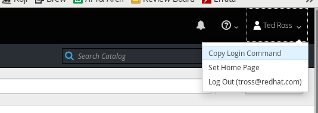

# demo2-amq
Workload, Tools, and scripts for the AMQ section of Demo-2.

This demonstration shows how to deploy a distributed application into multiple OpenShift clusters
in both on-premises and public-cloud data centers.

The locations used in this demonstration are:
  - ONPREM - An on-premises cluster.  This may be your laptop, if you wish.
  - AWS - A cluster hosted on Amazon Web Services
  - GCP - A cluster hosted on Google Cloud Platform
  - AZURE - A cluster hosted on Azure

## Setting up the Demo

The first time you set up this demo, you must generate the TLS
certificate authority, certificates, and keys that will be used to secure the
inter-cluster connections.

Note that this script uses `openssl` to generate keys and certificates.

```
$ cd scripts
$ ./generate-certs
```

You must create environment variables in your working environment to identify the
route suffixes of each of the OpenShift clusters.  The route suffixes will likely
be in the form "<IP-address>.nip.io".

The environment variables are:
  - ONPREM_SUFFIX
  - AWS_SUFFIX
  - GCP_SUFFIX
  - AZURE_SUFFIX

Please note that this demonstration may be run without all of the public cloud clusters
in place.  There must be at least one public cloud cluster and the on-premises cluster
for the demonstration to be meaningful.

You can now deploy the various footprints by logging into OpenShift for
each cluster and running the `setup-*-all` script.  Use the `Copy Login
Command` feature on the OpenShift Web UI to obtain the correct login command.

<center>

</center>

```
$ oc login <AWS Login>
$ ./setup-aws-all

$ oc login <Azure Login>
$ ./setup-azure-all

$ oc login <GCP Login>
$ ./setup-gcp-all

$ oc login <OnPrem login>
$ ./setup-onprem-all
```

Please note that you may use `setup-*-ic-only` to deploy only the AMQ
Interconnect network without the services for this demo.  This might be useful
if you wish to use the network for a different distributed service deployment.

Once the projects are running on their respective clusters, you
may access the AMQ Interconnect Console using the "console" route configured on the
ONPREM cluster.

